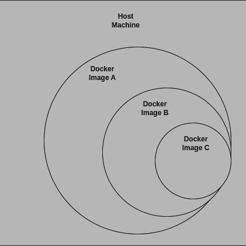

# DinD_with_Code
If you are from my Linked post, welcome back. Here, I will clear up the Docker in Docker concept with the simpleset example. 
<p align="center">
  
</p>

### Requirements
Install and set rootless docker access. Which means if you can run 

```
docker run hello-world
```

without sudo, that means rootless docker access is enabled. Otherwise google how do do it. 

### Folder structure
**Folder A**:
- Dockerfile: The Dockerfile in Folder A imports the `docker:19.03.12-dind` image from Docker Hub (https://hub.docker.com/_/docker/tags?name=dind).

- Functionality: This Dockerfile builds the image and runs the dind-b-container container inside A's scope. A triggers B to run.

**Folder B**:
- Dockerfile: Similarly, Folder B contains a `Dockerfile` that also imports the `docker:19.03.12-dind` image from Docker Hub.

- Functionality: The Dockerfile inside `B` runs the `dind-c-container` container within `B'`s scope. `B` passes an environment variable, `MY_VAR_B`, to `C`.

**Folder C**:
- Logic: Folder `C` contains a Python script that reads the environment variable `MY_VAR_B` passed from `B` and prints its value.

### Run code

Create three different docker image out of the folders.

For C
```
docker build -t dind-c-container C/
```

For B
```
docker build -t dind-b-container B/
```
`

For A
```
docker build -t dind-a-container A/
```

Finally run A with docker run with the following command

```
docker run --privileged --rm --name dind-a-container -v /var/run/docker.sock:/var/run/docker.sock dind-a-container
```

With the `-v` command, you are mounting `A`'s Docker socket directory (`/var/run/docker.sock`) to the host's Docker socket (`/var/run/docker.sock`). Then, `A` performs the same mounting for `B`'s Docker socket, allowing `B` to interact with the host's `Docker` daemon. `B` then does the same mounting with `C`'s Docker socket, enabling `C` to also communicate with the host's Docker daemon."

This mechanism of chaining containers with Docker-in-Docker (DinD) can also be applied in a CI/CD pipeline. For example, a pipeline could use a similar setup to run tests, build images, and deploy containers across multiple stages, where each container in the chain performs a specific task (e.g., building, testing, deploying) and communicates with the host Docker daemon.
